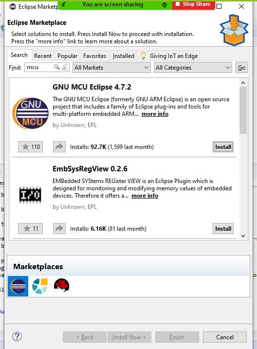
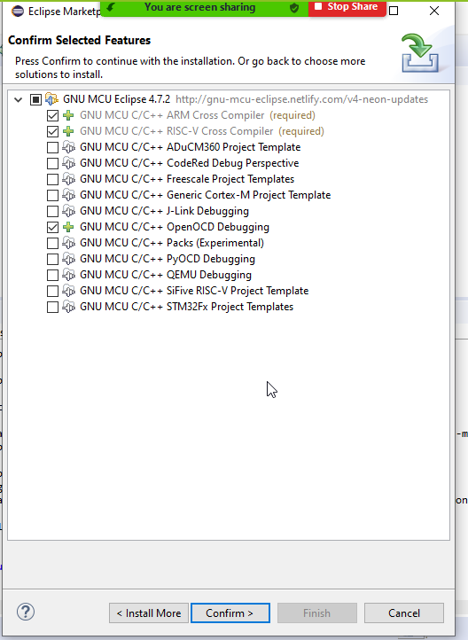
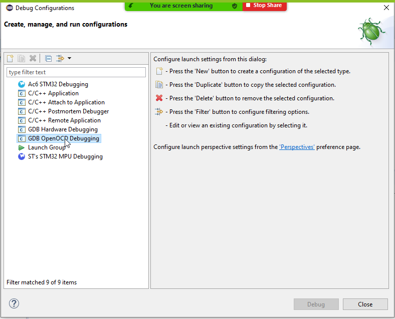
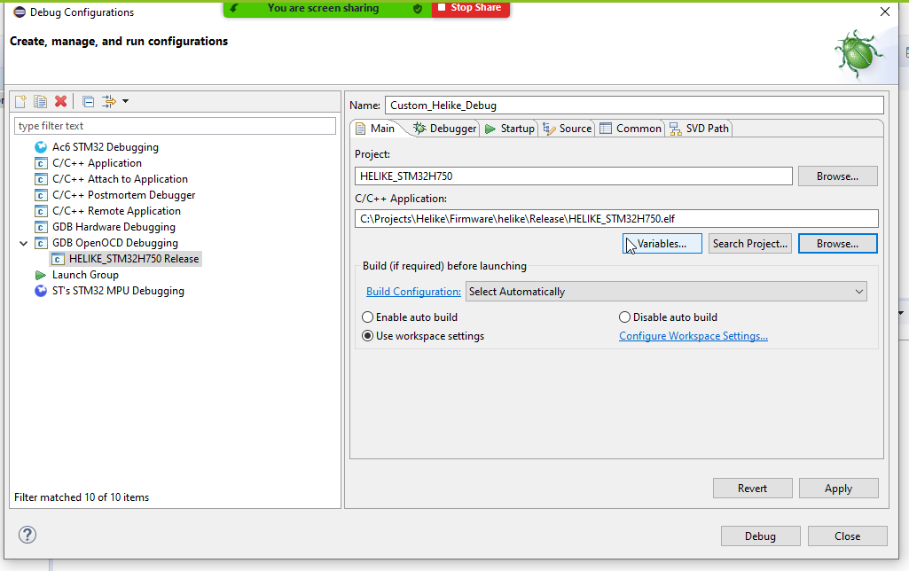
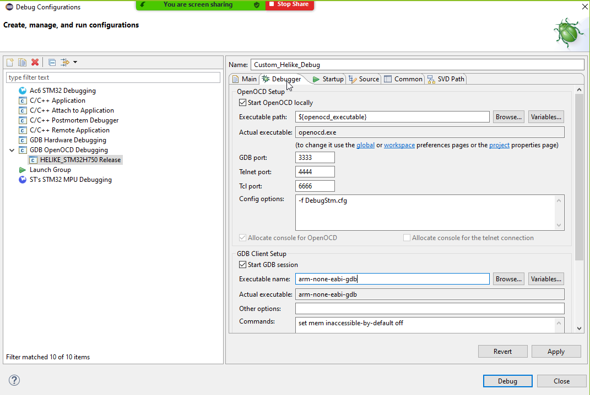

# Helike DSP Software Compilation Guide
## 1 Requirements
### 1.1 IDE
- [System Workbench for STM32](https://www.openstm32.org/Downloading%2Bthe%2BSystem%2BWorkbench%2Bfor%2BSTM32%2Binstaller)

### 1.2 Other tools
#### 1.2.1 Single archive (Recommended)
- [Helike Build Tools](https://www.dropbox.com/s/nlasrjxphlbaqhi/Helike_Tools_1V0.zip?dl=1)

#### 1.2.2 Or individually (Advanced)
- [ARM GCC Toolchain](https://developer.arm.com/tools-and-software/open-source-software/developer-tools/gnu-toolchain/gnu-rm/downloads)
- [OpenOCD](https://github.com/xpack-dev-tools/openocd-xpack/releases)
- [GNU Make](http://www.equation.com/servlet/equation.cmd?fa=make)

## 2 Setup
### 2.1 Toolchain Setup (Recommended)
1. Download the required tools as a single archive mentioned in Section 1.2.1
2. Unzip the archive under C:\Projects\Helike\
3. You can skip Section 2.2 Toolchain Setup (Advanced)

### 2.2 Toolchain Setup - Individual downloads (Advanced)
If you have setup the toolchain as described in Section 2.1, you can skip this section and go to Section 2.3

1. Install **System Workbench for STM32** for Windows
2. Install **OpenOCD** under C:\Projects\Helike\Tools\openocd 
    - Binary files should be under C:\Projects\Helike\Tools\openocd\bin
3. Install **GNU Make** under C:\Projects\Helike\Tools\make
    - Binary files should be under C:\Projects\Helike\Tools\make
4. Install **ARM GCC** under C:\Projects\Helike\Tools\gcc
    - Binary files should be under C:\Projects\Helike\Tools\gcc\bin

### 2.3 Fetch the code
There are two ways to obtain Helike DSP Software. Internal R&D users can obtain it from USound Gitlab repository. Other users can obtain it from Github.
#### 2.3.1 Gitlab (Internal R&D)
git clone --single-branch --branch dynamic_compression https://kbala@gitlab.usound.com/nkostaras/helike.git
#### 2.3.2 Github (Public access)
git clone https://github.com/usound-tech/helike.git

## 2.3 Configure PATHS under System Workbench for STM32
1. Launch System Workbench for STM32
2. Import the project cloned in Section 2.2
3. Under Properties for the project HELIKE_STM32H750, make sure the PATH variable (Under C/C++ Build -> Environment) has these paths in the beginning of the string
- **C:\Projects\Helike\Tools\gcc\bin;C:\Projects\Helike\Tools\make;C:\Projects\Helike\Tools\openocd\bin;**
- If you have used a different path to install the required tools, please make sure it is reflected in the PATH here.

## 3 Compile Helike DSP Software 
1. Clean Project & Build Project 
2. Upon successful completion, the console output will look like this,

> text	   data	    bss	    dec	    hex	filename

> 127192	 410496	  10420	 548108	  85d0c	HELIKE_STM32H750.elf

## 4 Debug Helike DSP Software
### 4.1 Install GDB Open OCD Debugging via Help->Eclipse Marketplace

### 4.2 Setup OpenOCD Debug

### 4.3 Debug Helike DSP Software

Start debugging of the DSP Software by selecting Custom_Helike_Debug under Debug option. This will load the software and launch the debug perspective in Eclipse. Press Run to start the DSP software.
 

